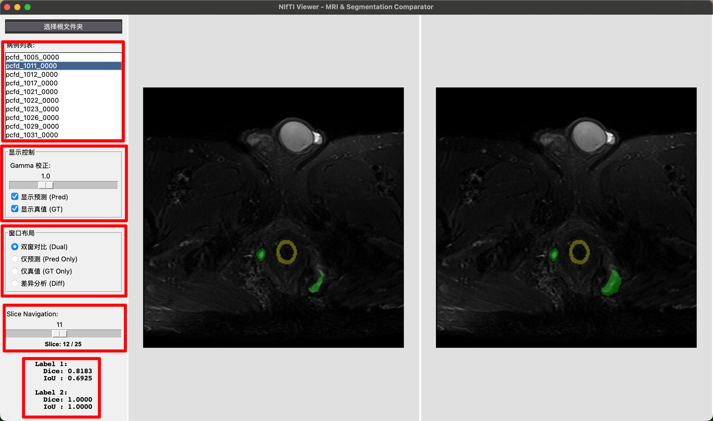

# NIfTI Viewer - 医学图像分割对比工具

这是一个基于 Python 和 Tkinter 开发的轻量级医学图像查看器，专为对比 MRI 原图、模型预测结果 (Pred) 和真值标签 (GT/Ground Truth) 而设计。支持 `.nii.gz` 格式。



## 🌟 核心功能

*   **智能数据加载**：自动扫描文件夹，识别 MRI、Pred 和 GT 文件。
*   **智能切片定位**：加载病例后优先定位到首个包含 Pred 或 GT 标签的切片；若无标签则回退到中间切片。
*   **编辑布局增强**：编辑模式采用“参考列 + 编辑窗”，支持参考窗固定宽度和宽度滑动调节。
*   **多视图布局**：
    *   **双窗对比 (Dual)**: 左右分屏同时显示预测和真值，方便横向对比。
    *   **单窗大图**: 支持“仅预测”、“仅真值”模式，最大化显示细节。
    *   **差异分析 (Diff)**: 自动生成 FP/FN 差异图，直观展示模型的多标与漏标区域。
*   **编辑引导层**：支持 `无 / Pred / GT / Pred+GT` 叠加引导，提供透明度与仅边界显示。
*   **交互式操作**：
    *   **切片导航**: 支持鼠标滚轮和滑动条快速切换切片。
    *   **缩放与平移**: 支持 `Ctrl` + 滚轮缩放与鼠标拖拽平移，多视图窗口同步。
    *   **快捷键**: 支持方向键切片切换、`Ctrl/Command + Z` 撤销。
*   **图像调节**:
    *   **Gamma 校正**: 实时调整 MRI 图像对比度。
    *   **图层开关**: 可一键隐藏/显示分割 Mask。
*   **标注与修正**:
    *   支持**画笔**、**橡皮擦**、**魔棒**工具进行 Label 修正。
    *   支持批量“导入 Pred/GT”、“减去 Pred/GT”、“全部转 Label 1/2”。
    *   支持填充策略（仅填充空白/替换全部）和作用范围（整卷/当前切片）。
    *   支持撤销操作 (Undo)。
    *   支持将修改后的 Label 快速导出（优先按当前已加载病例导出）。
*   **自动评估**: 实时计算并显示 Dice 系数和 IoU 指标（针对 Label 1 和 Label 2）。
*   **侧栏与状态**：支持分组折叠、滚动和分组摘要，底部状态栏显示 Case/Slice/Mode/Guide/Fill。
*   **外观**: 简洁的浅色模式界面，高对比度字体。

## 🛠 安装依赖

在使用本软件前，请确保您的环境中安装了以下 Python 库：

```bash
pip install numpy nibabel pillow
```

*   **Python 版本**: 建议 Python 3.8+
*   **系统要求**: Windows / macOS / Linux

## 📂 数据准备规范

本软件对输入数据的文件夹结构有严格要求，请确保您的数据符合以下规范：

**根目录必须包含以下文件夹**：
1.  **`imagesTr`** (必须): 存放 MRI 原图。文件名必须以 `_0000.nii.gz` 结尾。
2.  **`predictsTr`** (可选): 存放模型预测结果。文件名应为 `{CaseName}.nii.gz`。
3.  **`labelsTr`** (可选): 存放真实标签 (GT)。文件名应为 `{CaseName}.nii.gz`。

**文件对应关系示例**：
程序会根据原图文件名自动提取 `CaseName` 来匹配预测和GT。

```text
Dataset_Root/
├── imagesTr/                 # [必须] 原图文件夹
│   ├── Case10_0000.nii.gz    # CaseName = "Case10"
│   ├── Case11_0000.nii.gz
│   └── ...
├── predictsTr/               # [可选] 预测结果文件夹
│   ├── Case10.nii.gz         # 对应 Case10
│   ├── Case11.nii.gz
│   └── ...
└── labelsTr/                 # [可选] GT 文件夹
    ├── Case10.nii.gz         # 对应 Case10
    └── ...
```

> **提示**：如果缺少 `predictsTr` 或 `labelsTr` 文件夹，相关功能（如 Dice 计算、差异分析）将自动禁用。

## 🚀 使用指南

### 1. 启动软件
在终端中运行以下命令启动程序：

```bash
python src/nii_viewer.py
```

### 2. 加载数据
*   点击左上角的 **“选择根文件夹”** 按钮。
*   选择包含 `imagesTr`, `predictsTr`, `labelsTr` 的父级目录。
*   **默认路径**: 软件默认尝试打开 `~/Desktop/WAIYUAN_DATA`。
*   **文件夹结构要求**:
    必须包含 `imagesTr` 文件夹。可选 `predictsTr` 和 `labelsTr`。
*   示例路径：
```
Dataset_Root
├── imagesTr
│   ├── pcfd_1005_0000.nii.gz
│   └── ...
├── predictsTr
│   ├── pcfd_1005.nii.gz
│   └── ...
└── labelsTr
    ├── pcfd_1005.nii.gz
    └── ...
```

### 3. 操作说明

| 功能 | 操作方式 | 说明 |
| :--- | :--- | :--- |
| **切换切片** | 鼠标滚轮 (无修饰键) <br> 键盘 `←` / `→` 键 <br> 或 拖动左侧滑动条 | 上下翻阅 MRI 切片 |
| **图像缩放** | **Ctrl** (或 Command) + **鼠标滚轮** | 向上放大，向下缩小 |
| **移动视野** | 鼠标 **左键按住拖动** | 仅在放大状态下有效 |
| **调整亮度** | 拖动左侧 "Gamma" 滑动条 | 向右变亮，向左变暗 |
| **切换布局** | 点击左侧 Radio 按钮 | Dual / Pred Only / GT Only / Diff |
| **进入编辑** | 勾选顶部 "编辑模式" | 视图切换到编辑器，并显示参考列 |
| **编辑绘图** | 鼠标 **左键按住拖动** (编辑模式) | 使用当前工具绘图 |
| **编辑平移** | 鼠标 **中键按住拖动** (编辑模式) | 编辑模式下使用中键平移视野 |
| **撤销操作** | **Ctrl** + **Z** | 撤销上一步编辑 |
| **快速切片导航** | 键盘 **↑ / ↓ / ← / →** | 按步长切换前后切片 |
| **一键标签转换** | 点击顶部 “全部转 Label 1/2” | 将当前范围内全部非 0 标签统一转换到目标标签 |
| **批量导入标签** | 点击顶部 “导入 Pred / 导入 GT” | 将来源标签填充进编辑结果（遵循填充策略与范围） |
| **批量减标签** | 点击顶部 “减去 Pred / 减去 GT” | 删除与来源重叠的标签区域（遵循范围） |

### 4. 颜色图例

#### 常规模式 (Dual / Pred / GT)
*   🟢 **Label 1**: 绿色 (Green)
*   🟡 **Label 2**: 黄色 (Yellow)
*   *(透明度约 30%，叠加在 MRI 原图上)*

#### 差异分析模式 (Diff)
仅当存在 GT 时可用。
*   **Label 1 (绿色系)**:
    *   🟢 **亮绿色**: 多标 (False Positive) - 模型标了但 GT 没有。
    *   🌲 **暗绿色**: 漏标 (False Negative) - GT 有但模型没标。
*   **Label 2 (黄色系)**:
    *   🟡 **亮黄色**: 多标 (False Positive)。
    *   🟠 **暗橙色**: 漏标 (False Negative)。

### 5. 编辑与导出

*   **编辑模式**: 勾选顶部“开启编辑模式”后，右侧窗口即转为编辑区。
    *   若当前有 GT，则基于 GT 编辑。
    *   若无 GT，则基于 Pred 或空白 Mask 编辑。
    *   当无 GT 时，界面上“显示真值”与“仅真值”按钮将自动禁用。
    *   编辑模式下会显示左侧参考列（原图/Pred/Label），便于对照修正。
*   **工具**:
    *   **画笔**: 大小为 1 时为单像素点，可调节大小。
    *   **橡皮擦**: 擦除当前标签（写回 0）。
    *   **魔棒**: 点击区域自动填充，支持阈值 (默认为 5) 调节。
    *   光标悬停时会显示当前工具作用区域预览。
*   **引导层**:
    *   可选择叠加 Pred、GT 或 Pred+GT 作为编辑引导。
    *   支持透明度调节和“仅边界”显示，减少遮挡 MRI 细节。
*   **批量填充/替换**:
    *   “导入 Pred/GT”会将来源标签写入编辑掩码。
    *   策略可选“仅填充空白”或“替换全部”。
    *   范围可选“整卷”或“当前切片”。
*   **批量减去**:
    *   “减去 Pred/GT”会删除编辑掩码中与来源非零区域重叠的标签。
    *   适合快速去除误标区域。
*   **一键标签转换**:
    *   点击“全部转 Label 1”或“全部转 Label 2”可快速统一标签。
    *   仅转换非 0 且不等于目标标签的区域（空白背景保持 0）。
    *   转换范围跟随当前设置（整卷或当前切片）。
    *   支持撤销（Undo），转换后会自动同步当前编辑标签。
*   **撤销机制**:
    *   连续编辑和批量操作均可撤销。
    *   支持切片级撤销与整卷级撤销。
*   **导出 Label**:
    *   点击“导出 Label”按钮。
    *   文件将自动保存至根目录下的 **`EditLabelTrs`** 文件夹中。
    *   若文件夹不存在会自动创建。
    *   若文件已存在，会提示是否覆盖。
    *   导出优先使用当前已加载病例，减少错导风险。
    *   导出数据类型为整型标签（int8），并复用原 MRI 的空间信息（affine/header）。
    *   导出成功后，底部状态栏会显示蓝色提示信息。

## 📊 评估指标
软件侧边栏会自动显示计算出的指标：
*   **Dice**: Dice Similarity Coefficient (0.0 - 1.0)
*   **IoU**: Intersection over Union (0.0 - 1.0)
